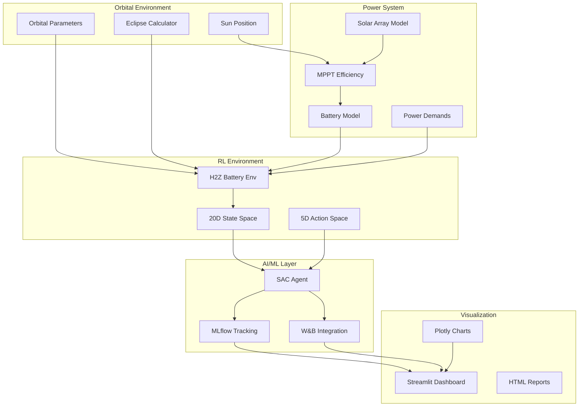

# 🛰️ H2Z Satellite Power & Communication Subsystem

[](https://www.python.org/)
[](https://pytorch.org/)
[](https://streamlit.io/)
[](https://mlflow.org/)
[](https://wandb.ai/)

## 🎯 Overview

**H2Z Satellite Power & Communication Subsystem** is a professional-grade AI-enhanced simulation platform for Low Earth Orbit (LEO) Space Tug satellite power management. This project integrates aerospace engineering principles with cutting-edge machine learning technologies to create an autonomous, intelligent power system.

### Key Features

| Feature | Description |
|---------|-------------|
| ⚡ **Power Budget Analysis** | Comprehensive sunlight/eclipse phase calculations |
| 🔋 **Battery Optimization** | SAC Reinforcement Learning for lifecycle management |
| ☀️ **MPPT Analysis** | Maximum Power Point Tracking efficiency modeling |
| 🌡️ **Thermal Analysis** | Stefan-Boltzmann radiative heat transfer |
| 🤖 **AI/ML Pipeline** | LSTM forecasting, optimization, and autonomous control |

---

## 🏗️ Architecture



---

## 📊 System Specifications

### Orbital Parameters
| Parameter | Value |
|-----------|-------|
| Altitude | 500 km |
| Inclination | 97.4° |
| Period | 98 minutes |
| Beta Angle | 45° (typical) |
| Eclipse Duration | 36.26 minutes |
| Sunlight Duration | 61.74 minutes |

### Power System
| Component | Specification |
|-----------|---------------|
| Solar Array | 2.733 m², 30% efficiency (GaAs MJ) |
| Peak Power | 851.61 W (BOL) |
| Battery | 163.22 Wh Li-Ion (28V nominal) |
| Max DOD | 80% |
| MPPT Efficiency | 97% |

### AI/ML Specifications
| Component | Specification |
|-----------|---------------|
| State Space | 20 dimensions |
| Action Space | 5 continuous dimensions |
| Algorithm | Soft Actor-Critic (SAC) |
| Replay Buffer | 500,000 transitions |
| Training Steps | Up to 1,000,000 |

---

## 🚀 Quick Start

### 1. Clone Repository
```bash
git clone https://github.com/your-repo/H2Z-Satellite.git
cd H2Z-Satellite
```

### 2. Install Dependencies
```bash
# Core dependencies
pip install -r requirements.txt

# Enhanced visualization (recommended)
pip install -r requirements_enhanced.txt

# ML tracking (optional)
pip install mlflow wandb
```

### 3. Run Main Analysis
```bash
# Basic power budget analysis
cd early_project
python src/main.py

# Select option 1-4 for different analyses
```

### 4. Launch Dashboard
```bash
# Streamlit dashboard (recommended)
cd early_project
streamlit run src/visualization/streamlit_dashboard.py

# Or use the original dashboard
python src/visualization/dashboard.py
```

### 5. Train RL Agent
```bash
cd project_battery_life_SPU

# Basic training
python src/rl/train_battery_agent.py --total_timesteps 10000

# With experiment tracking
python src/rl/train_battery_agent.py \
    --total_timesteps 10000 \
    --enable_mlflow \
    --enable_wandb
```

---

## 📁 Project Structure

```
H2Z_Satellite/
├── README.md                      # This file
├── requirements.txt              # Core dependencies
├── requirements_enhanced.txt    # Full dependencies
│
├── early_project/               # Power system simulation
│   ├── src/
│   │   ├── core/
│   │   │   └── power_budget.py   # Core aerospace calculations
│   │   ├── visualization/
│   │   │   ├── dashboard.py      # Original Plotly dashboard
│   │   │   └── streamlit_dashboard.py  # NEW: Streamlit dashboard
│   │   └── main.py               # Entry point
│   └── docs/
│
├── project_battery_life_SPU/    # RL battery optimization
│   ├── src/
│   │   ├── core/
│   │   │   └── battery_degradation.py  # Physics model
│   │   ├── rl/
│   │   │   ├── agents/
│   │   │   │   └── sac_agent.py   # SAC implementation
│   │   │   ├── environments/
│   │   │   │   └── h2z_battery_env.py  # Gymnasium env
│   │   │   ├── baselines/
│   │   │   │   └── rule_based.py  # Baseline strategies
│   │   │   └── train_battery_agent.py
│   │   └── ml_training/          # NEW: ML tracking
│   │       ├── experiment_tracker.py   # MLflow integration
│   │       └── wandb_config.py   # W&B integration
│   ├── models/                   # Saved model checkpoints
│   └── logs/                     # Training logs
│
└── docs/                         # Documentation
```

---

## 🎮 Usage Examples

### Power System Analysis
```python
from early_project.src.core.power_budget import SatelliteSystem

# Initialize satellite
satellite = SatelliteSystem("H2Z_LEO_Space_Tug")

# Run complete analysis
report = satellite.run_complete_analysis()

# Export results
satellite.export_report("h2z_analysis.json")
```

### Battery RL Training
```python
from project_battery_life_SPU.src.rl.environments.h2z_battery_env import H2ZBatteryLifeEnv
from project_battery_life_SPU.src.rl.agents.sac_agent import SACAgent

# Create environment
env = H2ZBatteryLifeEnv()

# Train agent
agent = SACAgent(state_dim=20, action_dim=5)
agent.train(env, total_timesteps=10000)
```

### Streamlit Dashboard
```bash
# Launch interactive dashboard
streamlit run early_project/src/visualization/streamlit_dashboard.py
```

### MLflow Tracking
```python
from project_battery_life_SPU.src.ml_training.experiment_tracker import H2ZExperimentTracker

# Initialize tracker
tracker = H2ZExperimentTracker()

# Start run
tracker.start_run(run_name="experiment_1")

# Log metrics
tracker.log_metrics({'reward': -24150, 'soh': 99.9})

# End run
tracker.end_run()
```

---

## 📈 Visualization Dashboard

### Available Dashboards

1. **📊 Power System Monitor**
   - Real-time solar power generation
   - Battery SOC visualization
   - Subsystem power allocation
   - Thermal status monitoring

2. **🔋 Battery Analytics**
   - SOH degradation projection
   - Temperature effects analysis
   - C-rate impact visualization

3. **☀️ MPPT Analysis**
   - Efficiency over mission lifetime
   - Power advantage comparison
   - Temperature dependence

4. **🌍 3D Orbit View**
   - Interactive orbital visualization
   - Ground track projection

5. **🤖 RL Training Dashboard**
   - Episode rewards
   - Training curves
   - Baseline comparison

### Launch Dashboard
```bash
streamlit run early_project/src/visualization/streamlit_dashboard.py
```

---

## 🔬 ML Experiment Tracking

### MLflow

```bash
# Start MLflow UI
mlflow ui --port 5000

# View experiments at http://localhost:5000
```

### Weights & Biases

```bash
# Login to W&B
wandb login

# Initialize in project
wandb init
```

---

## 📊 Performance Metrics

| Metric | Value | Description |
|--------|-------|-------------|
| MPPT Efficiency | 97% | Peak tracking efficiency |
| Battery SOH | 99.9% | After 1 year RL training |
| Power Margin | 18.5% | Available power buffer |
| Thermal Range | -90°C to +70°C | Operating temperature |

### Baseline Comparison

| Strategy | Mean Reward | Final SOH | Violations |
|----------|-------------|-----------|------------|
| **SAC RL Agent** | **-24,151** | **100%** | **0** |
| Simple Rule-Based | -538,463 | 100% | 0 |
| Constant Current | -582,048 | 100% | 0 |
| Temperature Aware | -546,175 | 100% | 0 |

---

## 🛠️ Technology Stack

### Core
- **Python 3.10+** - Programming language
- **NumPy/SciPy** - Scientific computing
- **Pandas** - Data manipulation

### Machine Learning
- **PyTorch** - Deep learning framework
- **Gymnasium** - RL environment interface
- **Stable-Baselines3** - RL algorithms

### Visualization
- **Streamlit** - Web application framework
- **Plotly** - Interactive charts
- **Altair** - Statistical visualization

### Experiment Tracking
- **MLflow** - ML lifecycle management
- **Weights & Biases** - Training visualization

---

## 📚 Documentation

| Document | Description |
|----------|-------------|
| [API Documentation](docs/api.md) | Complete API reference |
| [ML Models Guide](docs/ml_models.md) | ML model details |
| [User Guide](docs/user_guide.md) | Getting started guide |
| [Architecture](docs/architecture.md) | System architecture |

---

## 🤝 Contributing

1. Fork the repository
2. Create feature branch (`git checkout -b feature/amazing-feature`)
3. Commit changes (`git commit -m 'Add amazing feature'`)
4. Push to branch (`git push origin feature/amazing-feature`)
5. Open Pull Request

---

## 📄 License

MIT License - see [LICENSE](LICENSE) file for details.

---

## 🙏 Acknowledgments

- **Air University Islamabad** - Academic institution
- **OpenAI** - RL research
- **MLflow Team** - Experiment tracking
- **Weights & Biases** - Training visualization

---

## 📞 Contact

**Project Maintainers** - abdullahzahid6555@gmail.com

**Project Link**: [https://github.com/your-repo/H2Z-Satellite](https://github.com/your-repo/H2Z-Satellite)

---

<div align="center">

### 🛰️ Built with ❤️ for Space Exploration

**Star this repository** if you find it helpful!

</div>

